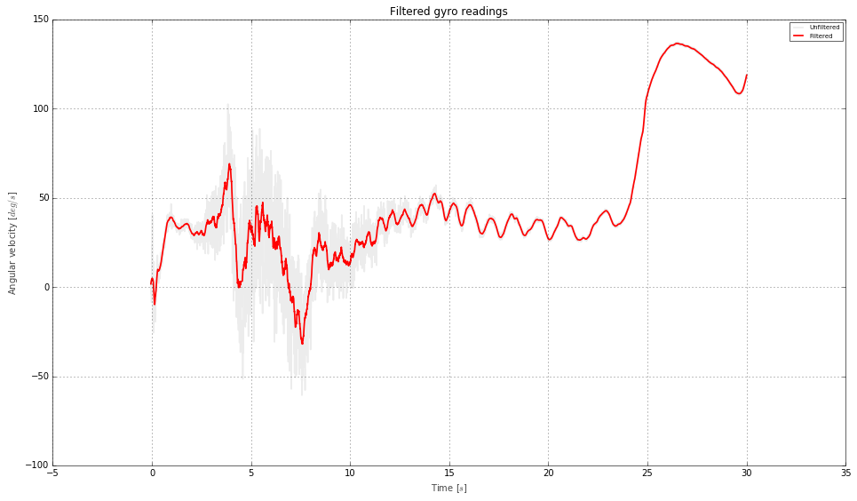
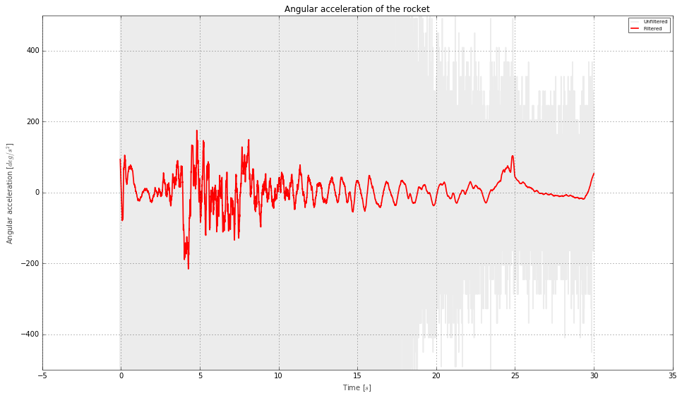
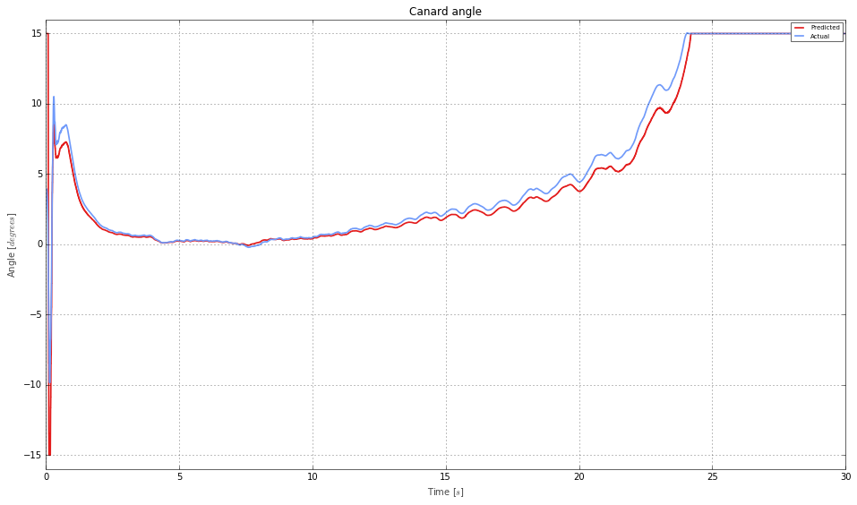
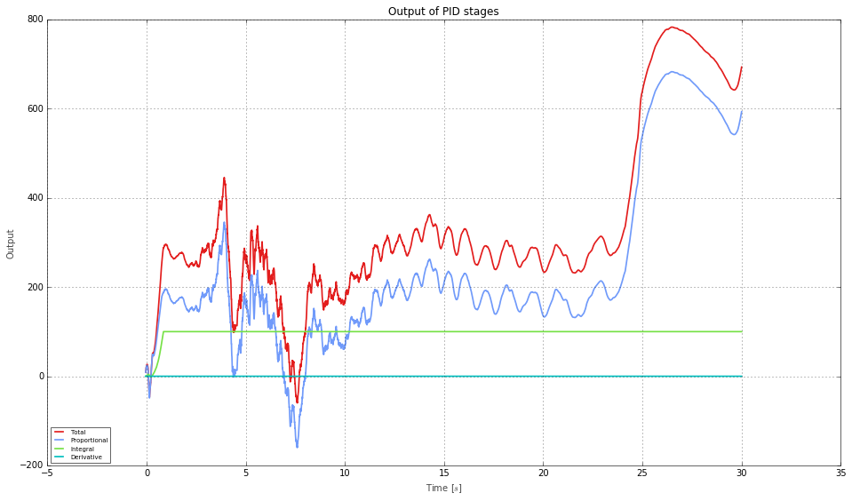
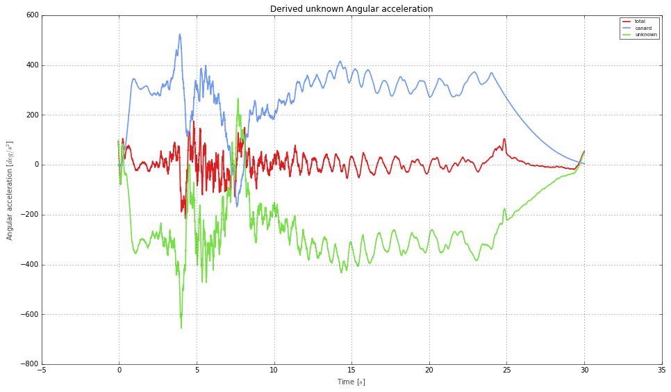
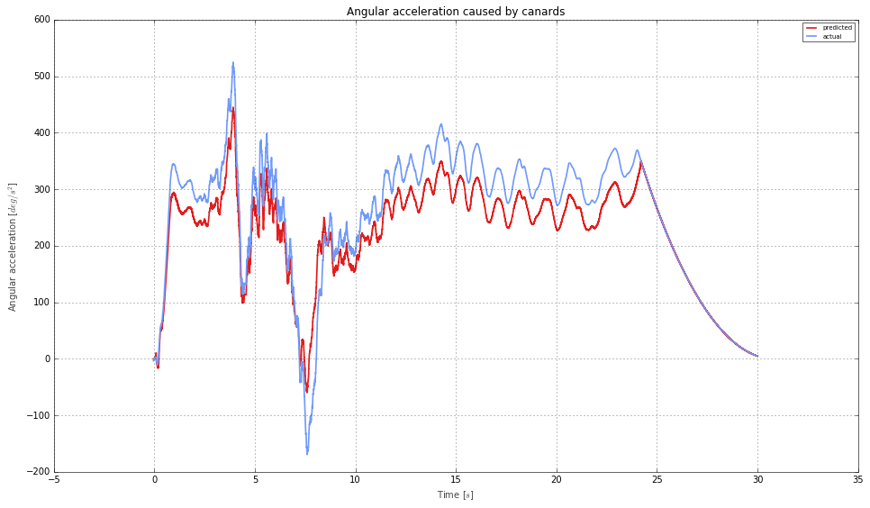
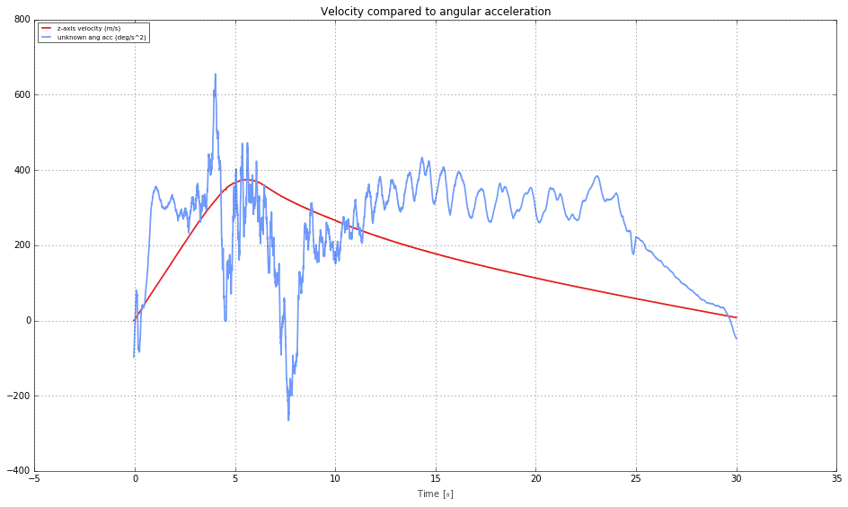

# Roll control analysis Pt. 2 
*by William Harrington*  
*Portland State Aerospace Society*  

In the last notebook, I looked at the velocity and altitude curves plus the angular position, angular velocity, and angular acceleration of the Launch-12 flight data.

I found that the average angular acceleration during the flight was 0. This means that the roll control system was successful in keeping the roll rate (angular velocity) relatively constant. Therefore, the derivative of this data (angular acceleration) would be 0 on average. From this I have concluded that in order to keep the roll rate to 0, as was originally intended, the PID loop should of been designed for controlling roll angle and not roll rate.
                 
This time I want to take a look at the output of the PID loop so I can examine how the control loop was performing during flight. The control loop was designed to use the output of the PID to estimate an angular position for the canards so they can create a torque that opposes the one being imposed on the rocket. The angular position is clamped to +/- 15 degrees. A request for that angular position is then sent to the Flight Computer. It is important to note that there is a latency here that we assume is around 3ms. The code that simulates this returns to us the current angular position of the canards, and every 3ms accepts the angular position that was sent. The current angular position of the canards tells us the angular acceleration being caused by the canards.

I will need the accelerometer and gyro readings to do this. I can use the accelerometer readings to get altitude and velocity which are important parameters in our mathematical model that describes the angular acceleration caused by the 4 canards. Then I can use the gyro readings by feeding them to the PID loop and observing the output.  

The gyro readings are noisy so I will need to eliminate some of that noise to make sense of what is going on. A lowpass filter should do the trick.  

    Average filtered angular acceleration: 3.96 deg/s^2

### Canard Angle

Whew ok now that's over lets look at what the hell this thing was doing!

First lets glance at the canard angle.  

Seems as though our algorithm worked as intended.
### PID controller output
Now lets look at the outputs given by the PID controller. We didn't save the output of the PID controller during the flight so there is nothing for us to reference here. However, it is reasonable to believe that feeding the gyro readings through the PID controller code would put out the same thing.

    Average output of proportional stage: 237.20
    Average output of integral stage: 97.74

As expected, the proportional stage does the heavy lifting, making up the majority of the total output of the PID. The integrator quickly saturates and remains constant for the rest of the flight.

### Deriving unknown angular acceleration

The total angular acceleration on the rocket has to be equal to the sum of angular acceleration caused by the canards and some unknown angular acceleration being imposed on the rocket.  
i.e. ang_acc = canard_ang_acc + unknown_ang_acc  
&nbsp;&nbsp;&nbsp;&nbsp;&nbsp;unknown_ang_acc = ang_acc - canard_ang_acc

### Angular acceleration caused by canards

### How does the unknown angular acceleration scale with velocity?

One of the assumptions made in simulating flight was that the unknown angular acceleration scales with velocity because the damping force of a spring oscillator is normally linearly dependent on velocity.

Let's see how they compare.

Doesn't seem to scale at all. This is absolutely the worst case scenario that we envisioned.
