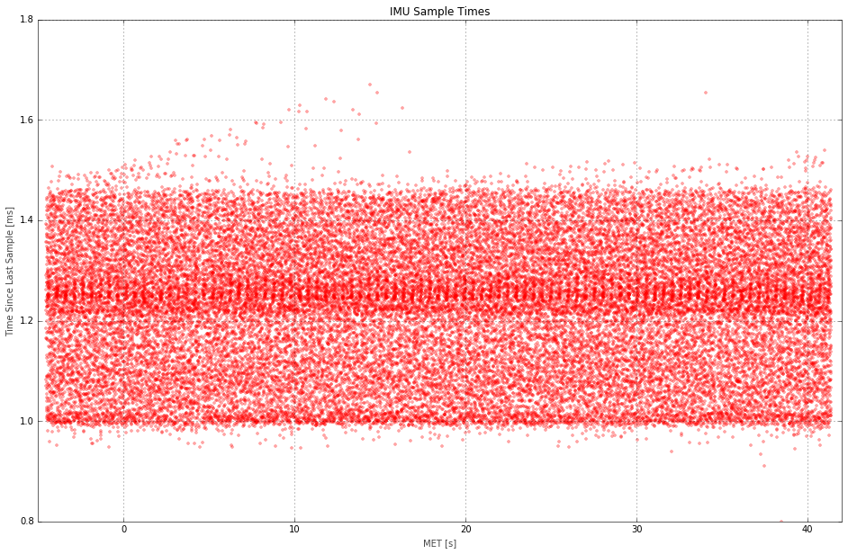
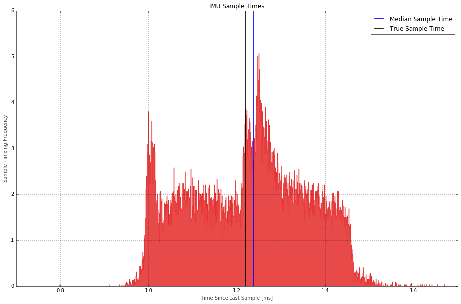

# Missing Data And Timing Jitter

During Launch-12 several flight comptuer events were recorded that indicated a loss of data.

## Sequence Numbers And Ethernet

All data sent from the instruments in the rocket are sent over physical ethernet cables to a network switch on the top of the stack, then the main computer recieves them. In the flight executive incoming packets are recieved and the high resolution timestamp of the exact recieve time recoreded.

[Ethmux code from the FC in the av3-fc repo](https://github.com/psas/av3-fc/blob/master/src/ethmux.c#L81)

All the sequential data, like from and IMU or other device polled on an interval, is sent over the network with a sequence number so we can detect missing data on receipt. Skipped sequence numbers are recoreded by the `SEQE` ("Sequence Error") definition and recorded in the log.

We did not expect to miss any data. The network stack should have been streaming well below it's theoretical limit. However when checking the logs in for SEQE Data, we see this:

    # [0]SEQN, [1]Timestamp, [2]Port, [3]Expected, [4]Received
    90773,117853569585227,36104,0,8
    91043,117858129510270,35050,1226761,1226909
    91043,117858129808842,36102,40579215,40579289
    91043,117858129839223,35020,517997,518057
    91043,117858138465250,35011,63515,63523
    91044,117858155230720,35051,12714,12716
    92850,117888289641109,35050,1287069,1287172
    92850,117888289665553,36102,40609395,40609447
    92850,117888290206334,35020,542634,542676
    92850,117888297660564,35011,66534,66539
    92851,117888311705227,35051,13337,13338
    

At several times we get a sequence error from multiple ports. In each case there is a chunk of missing data.

The incoming port numbers can be decoded as follows:

 - 36104: RNH_UMBDET (Umbilical disconnect signal)
 - 35050: JGPS_PORT (Raw GPS data)
 - 36102: RNH_PORT (Battery and power data)
 - 35020: ADIS_PORT (IMU data)
 - 35011: BMP_PORT (Pressure data)
 - 35051: GPS_COTS (Standard, comercial GPS data)
 
In the flight there were two significant upset events where we lost at least one or more packets of data from nearly every sensor on the rocket(!)

## Lost milliseconds In IMU Data

If we chart the difference in recieve time between each and every sample of IMU data we should see these two gaps show up (log scale to see the baseline and the huge jumps):

The expeced time between samples from the ADIS IMU is 1.22 ms. However there are two big gaps in the data:

    At time  4.560 s:   74.5 ms
    At time 34.721 s:   52.6 ms

## Average Sample Time

If we ignore the bumps we should learn something about the jitter in the recieved sample time. The assumption is that the actual sample time was pretty uniform, and most of the jitter is from uncertaninty in the network stack and non-realtime OS that the flight computer is running.

Here we chart (linear scale this time) just the non-gap diffs

## Jitter

It's not gaussian. In fact the bump at almost exactly 1 ms is hard to explain.

Clearly there is some lower bound for timing. One might suspect that almost every time a packet arrives slightly late, the next one is likely to be on time (regression to the mean) so that there are an abundance of "short" arrivals that appear to get here quicker than they should. Why that number should be so close to 1.0 ms is hard to say.

Here are some statistical numbers for the jitter:

    True Sample Time:          1.221 ms
    Median Actual Sample Time: 1.238 ms
    Standard Deviation:        0.132 ms

